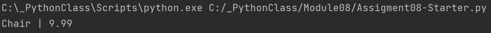
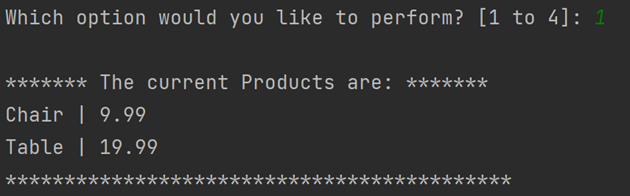

Thomas Nord
08-30-2022
Foundations of Programming (Python)
Recap of Module 08 – Objects and Classes
[https://github.com/nordthomas/IntroToProg-Python-Mod08](https://github.com/nordthomas/IntroToProg-Python-Mod08)

# Creating an Inventory Program

## Introduction
For this week’s assignment we needed to take a starter script and update it to illustrate real world use of classes and objects in Python. The goal of the program is to gather user input, in this case a product name and price, that will be stored as an object and then add it to a list of objects. We should be able to write that data to a file and also read the data from that file. 

## Reviewing the Starter Script
To begin I reviewed the starter script we were provided. It contains all the pseudo code we need to understand our objective and clearly outlines our separation of concerns. We have a class named `Product` that will be used to create our objects, a class named `FileProcessor` to handle reading from and writing to our file, and a class named IO for handing our user interactions such as showing the menu and gathering user input. The `Product` and `FileProcessor` classes contain doc strings which will give us a good starting point along with the existing pseudo code. 

The first thing I want to do is update my script header to track my work in the script. This will also include updating the changelog in the various class docstrings. The IO class doesn’t contain a docstring so I’ll add one (Figure 1). 
 

***Figure 1: The IO class docstring***

I know I’ll need to write some methods but I don’t know what they’ll be yet so I just add a section for them and leave it blank for now. 
The last thing I added before digging into the code was a new variable. We started with:

  strFileName = 'products.txt'
  lstOfProductObjects = []

However, when working with files I know we’ll need not only a string for our file name, but also a file handle so I created the `objFile` variable for that and set it to `None`. 

## The Product Class
### Fields
First on our `TODO` list is dealing with the contents of the `Product` class. We do not have any methods to start with so we’ll have to look at what we might need. Our docstring tells us that we need 2 properties: 

  properties:
      product_name: (string) with the product's name
      product_price: (float) with the product's price
    
So, we need to build an object that receives a name and a price. We’ll start by adding 2 fields and setting some default values. 

  product_name = ""
  product_price = 0

### Constructor
Now that we have a couple fields to hold the data we want the object to encapsulate we can start writing our methods. A good place to start is with our initialization constructor, which will automatically run whenever we create our object. 

  def __init__(self, product_name = "", product_price = 0):
      self.product_name = product_name
      self.product_price = product_price
    
This constructor is a method with 2 underscores before and after the word “init”, followed by our parameters which, in this case, are the keyword `self` followed by the two fields we set earlier. Because we want to be able to access the fields from within the class we need to use that self parameter at the beginning of our variables within the method. So we set a variable called `self.product_nam`e and assign it our `product_name` parameter. Then we do the same for `product_price`. 

### The __str__() Method
Because we’re going to be working with objects containing string data, it’s a good idea to create a new `string` method which will replace the built-in one. This will ensure that when we print the object we’ll get something more human-readable and formatted to our needs. Like the constructor, we use the double underscore (“duder”) in the method name: 

  def __str__(self):
      return self.product_name + " | " + self.product_price
    
The `return` statement is set up to give us the name of our product and the price of the product separated by a pipe (|). This will make the data that we inject to our file later easier to read. 

### Getters and Setters
The starter script let us know that we would need some properties for this class, one for `product_name` and one for `product_price`. In Python a getter property starts with a `@property` decorator while the setter property starts with `@name_of_method.setter`. The getter property is used to add formatting to your code and the setter is used for validation and error handling. In my case I didn’t want to restrict the names users could enter for products so my getter and setter properties are the base methods. 

  @property
  def product_name(self):
      return self.__product_name

  @product_name.setter
  def product_name(self, name):
     self.__product_name = name
     
I did try to figure out how to disallow entering a blank product name but because I have a blank string as my default for `product_name` the error handling would always fire making my code not work the way I like. 

For `product_price` I was able to validate that the price could not be below 0 with a simple `if-else` conditional. 

  @property
  def product_price(self):
      return str(self.__product_price)

  @product_price.setter
  def product_price(self, value):
      if value < 0:
          print("You must enter a valid price.")
      else:
          self.__product_price = value
        
### Testing our Class
We can quickly test that our class is working with some simple test code. 

  objprod = Product()
  objprod.product_name, objprod.product_price = "Chair", 9.99
  print(objprod)

Here we’re creating an object instance of the `Product` class and assigning it to `objprod`. Then I create a variable for the product name as well as the price using dot notation - doing so will force the variables to use our property logic. I assigned a couple values manually then print the result of `objprod` (Figure 2). 

***Figure 2: The result of our test code***

## Writing to the File
The `FileProcessor` method docstring tells us we have at least 2 methods to write but I have added a third. Over the course of this class I have been using a function to check if the file we want to write to exists and if it doesn’t then I create it. 

  @staticmethod
  def create_file(file, file_name):
      """  Create empty file on disk
  
       :param file: (object) file handle:
      :param file_name: (string) name of file on disk:
      :return: nothing
      """
      if file == None:
          file = open(file_name, "a")
          file.close()
          
Now, I no longer need to create the file manually which is a huge timesaver when testing. And don’t forget to also add this method to your docstring!
The next method we need is one to read data from the file on disk (`read_data_from_file`). This basically like any other function we’ve used to read data from a file so I used the code from Assignment 6 and updated the parameter names. 

  @staticmethod
  def read_data_from_file(file_name, list_of_rows):
      """ Reads data from a file into a list
  
      :param file_name: (string) with name of file:
      :param list_of_rows: (list) you want filled with file data:
      :return: (list) of rows
      """
      list_of_rows.clear()  # clear current data
      file = open(file_name, "r")
      for row in file:
          list_of_rows.append(row)
      file.close()
      return list_of_rows
      
The method to write the data to our file is also very similar to the one used in Assignment 6 but with one important change. When we write the data, by default it will use the built-in __str__ method for our class and that would result in an error since the write method requires a string (Figure 3). 
 
 

***Figure 3: Error writing Product to file***

To solve this we need to convert the data to a string which will then invoke our custom `__str__` method and provide the user with human readable data. 

  @staticmethod
  def save_data_to_file(file_name, list_of_rows):
      """ Writes data from a list of object rows to a File
  
      :param file_name: (string) with name of file:
      :param list_of_rows: (list) containing your data:
      :return: (list) of objects
      """
      file = open(file_name, "w")
      for row in list_of_rows:
          file.write(str(row).strip() + "\n") # calls __str__()
      file.close()
      print("Data saved to file!")
      return list_of_rows

## The IO Class
The `IO` class is going to look very familiar as we did something very similar in Assignment 6 a couple weeks ago. I started by copying the functions for generating our menu and capturing the user’s choice and updating them with the information relevant to this assignment. 

  @staticmethod
  def output_menu_tasks():
      """  Display a menu of choices to the user
  
      :return: nothing
      """
      print('''
      Menu of Options
      1) Show Current Products
      2) Add New Product
      3) Save Data to File        
      4) Exit Program
      ''')
      print()  # Add an extra line for looks

  @staticmethod
  def input_menu_choice():
      """ Gets the menu choice from a user
  
      :return: (string) of user's menu choice
      """
      choice = str(input("Which option would you like to perform? [1 to 4]: ")).strip()
      print()  # Add an extra line for looks
      return choice
      
The next method we needed according to the list of `TODO`s in the start script was something that presented the user with a list of the current data. This would include any data from the existing file that we read and any new data entered by the user. As our script will capture all of that data in to a single list which we have already declared (`lstOfProductObjects`) we just need to pass in that single argument and use a `for` loop to print out the data. I also added a little formatting to make the list look a little nicer. 

  @staticmethod
  def show_current_data(list_of_rows):
      """  Shows current list of products
  
      :param list_of_rows: (list) of current products:
      :return: nothing
      """
      print("******* The current Products are: *******")
      for row in list_of_rows:
          print(str(row).strip())
      print("*******************************************")
      
You’ll note that again, we converted our list of objects to a list of strings for the purposes of readability. 
Now that we have all our methods, don’t forget to update that docstring. 

  """ Performs Input and Output tasks
  
      methods:
          output_menu_tasks():
          input_menu_choice(): -> (string)
          show_current_data(list_of_rows):
          get_data_from_user(): -> (string),(float)
  
      changelog: (When,Who,What)
      TNord,8.30.2022,Modified code to complete assignment 8
  """

## The Body of the Script
Now that we have all of our classes written and functional it is time to start building the main body of our script. Because we spent our time putting all of our logic in to classes and functions this part of the process will pretty quick. 

The first thing I want to do when the program loads is to create a file on disk if there isn’t one already. Creating the file now ensures that we have a file early enough in the logic that any calls we make to the file will not result in errors. As I made a function for creating the file I just need to call it with two arguments, one for the file’s handle and one for the file’s name: 

  FileProcessor.create_file(file=objFile, file_name=strFileName)

The next thing we need to do is present the user with a menu and then set a variable to capture their menu choice. We already have functions for both of these so all we need to do is place them inside of a `while` loop to get us started. 

  while (True):
      IO.output_menu_tasks()
      strchoice = IO.input_menu_choice()
      
With the menu in place we set up we need to add the logic for the different menu choices. Our first menu option allows the user to see the currently available data. This will be our list of objects (`lstOfProductObjects`) which includes the data from the file on disk and any new objects the user may have added during this session. Once that has been displayed, we return the user to the main menu. 

  if strchoice.strip() == '1':  # Show Current Data (Product Objects)
      IO.show_current_data(list_of_rows=lstOfProductObjects)
      continue
      
The second menu option allows the user to add a new product and its price to the current list of objects (`lstOfProductObjects`). In order to do that we need to first create the object which we do by invoking the Product class and assigning it to our variable (`objprod`). While this creates the object instance it doesn’t create the data we want. We need the user to give us the data, so we set some variables and call our `IO.get_data_from_user()` function to gather the data to assign to them. Once we have an object with a product name and price the last piece is to append it to our existing list (`lstOfProductObjects`) and return the user to the main menu. 

  elif strchoice == '2':  # Add New Product to List of Product Objects
      objprod = Product()
      objprod.product_name, objprod.product_price = IO.get_data_from_user()
      lstOfProductObjects.append(objprod)
      continue  # to show the menu
      
The third menu option saves the current list of objects (`lstOfProductObjects`) to our file on disk. It takes 2 arguments: the name of the file we want to save to (`strFileName`) and the list of objects that we want to read our data from (`lstOfProductObjects`). 

  elif strchoice == '3':  # Save Current Data to File
      FileProcessor.save_data_to_file(file_name=strFileName, list_of_rows=lstOfProductObjects)
      continue
    
Our 4th menu choice needs to exit the program so we print a goodbye statement and break the loop and exiting the program. 

  elif strchoice == '4':  # Exit Program
      print("Goodbye!")
      break
    
The final part of our script captures any invalid input from the user and reminds them to enter a valid number. 

  else:
      print("Please enter a valid choice.")
      continue

## Testing
With the script complete we need to test it one last time to make sure everything is working as expected. 
When I start the program the menu is displayed (Figures 4.1 & 4.2). 

***Figures 4.1 & 4.2: Menu in shell and PyCharm, respectively***

I have no data yet, so I jump to option 2 to input some data (Figures 5.1 & 5.2).

***Figures 5.1 & 5.2: Entering product and price in shell and PyCharm, respectively***

Now that we have some data we can perform option 1 and show the data (Figures 6.1 & 6.2). 

***Figures 6.1 & 6.2: The data we entered in shell and PyCharm, respectively***

With the data confirmed we’re ready to save it to a file with option 3 (Figures 7.1 & 7.2).

***Figures 7.1 & 7.2: Save confirmed in shell and PyCharm, respectively***

Looking at the file on disk we can see that the data is indeed there (Figure 8). 

***Figure 8: The data in our file***

Lastly, when entering option “4” we exit the program (Figures 9.1 & 9.2).

***Figures 9.1 & 9.2: Goodbye!***

## Summary
In this assignment we took our starter script and its pseudo code and created a working program that captures inventory data from the user and stores it as a list of objects. We also demonstrated saving it to a file and reading the data from that file. 

Link to my published page: [https://github.com/nordthomas/IntroToProg-Python-Mod08](https://nordthomas.github.io/IntroToProg-Python-Mod08/)
